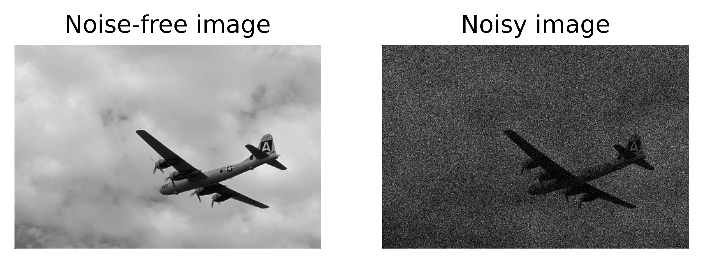

# PoGaIN: Poisson-Gaussian Image Noise Modeling from Paired Samples

Authors: Nicolas Bähler, Majed El Helou, Étienne Objois, Kaan Okumuş, and Sabine
Süsstrunk, _Fellow_, _IEEE_.

<!-- TODO: Replace arxiv with SPL -->

## [[ArXiv](https://arxiv.org/abs/2210.04866)] - [[Abridged Supplementary Material](https://github.com/IVRL/PoGaIN/blob/main/supplementary_material/abridged_supplementary_material.pdf)] - [[Complete Supplementary Material](https://github.com/IVRL/PoGaIN/blob/main/supplementary_material/supplementary_material.pdf)]

## Abstract

Image noise can often be accurately fitted to a Poisson-Gaussian distribution. However, estimating the distribution parameters from a noisy image only is a challenging task. Here, we study the case when paired noisy and noise-free samples are accessible. No method is currently available to exploit the noise-free information, which may help to achieve more accurate estimations. To fill this gap, we derive a novel, cumulant-based, approach for Poisson-Gaussian noise modeling from paired image samples. We show its improved performance over different baselines, with special emphasis on MSE, effect of outliers, image dependence, and bias. We additionally derive the log-likelihood function for further insights and discuss real-world applicability.

## Requirements

For this code base we used Python 3.9. More detailed package requirements can be
found in the [`environment.yml`](https://github.com/IVRL/PoGaIN/blob/main/environment.yml) file which can directly be used to build an
anaconda environment.

## Introduction

For this paper, we use a Poisson-Gaussian noise model introduced by Foi _et
al._ \[1\] to model noise that arises in imaging processes. Let us denote the
observed noisy image as $y$ and the ground-truth noise-free image as $x$. Then,
the Poisson-Gaussian model takes the following form:

$$
\begin{equation}
    y = \frac{\alpha}{a} + \beta, \quad \alpha \sim \mathcal{P}(ax), \quad \beta \sim \mathcal{N}(0,b^2).
\end{equation}
$$

For example, one might have an instance like:



where $a = 11$ and $b = 0.01$.

Our method (_Ours_) then estimates those parameters based on the noisy and noise-free
image pair using the cumulant expansion. As a baseline we implement another estimator based on variance
(_Var_) which also uses such image pairs. For the above example, we get the
estimates and the log-likelihood below:

```shell
===============
Ground truth:
a=11
b=0.01
===============
Log-likelihood:
LL=153825.966
===============
Var:
a=11.08914
b=0.02098
===============
Ours:
a=10.97338
b=0.00735
===============
```

<!-- TODO add arxiv citation and finally SPL -->

## Citation

```bibtex
@article{bahler2022pogain,
  title={{PoGaIN: Poisson-Gaussian} Image Noise Modeling from Paired Samples},
  author={B{\"a}hler, Nicolas and El Helou, Majed and Objois, {\'E}tienne and Okumu{\c{s}}, Kaan and S{\"u}sstrunk, Sabine},
  journal={arXiv preprint arXiv:2210.04866},
  year={2022}
}
```

<!-- ```bibtex
@article{bahler2022pogain,
  title={{PoGaIN}: {Poisson-Gaussian} Image Noise Modeling from Paired Samples},
  author={Bähler, Nicolas and El Helou, Majed and Objois, Étienne and Okumuş, Kaan and Süsstrunk, Sabine},
  journal={IEEE Signal Processing Letters},
  year={2022},
  publisher={IEEE}
}
``` -->

## References

\[1\] [https://webpages.tuni.fi/foi/papers/Foi-PoissonianGaussianClippedRaw-2007-IEEE_TIP.pdf](https://webpages.tuni.fi/foi/papers/Foi-PoissonianGaussianClippedRaw-2007-IEEE_TIP.pdf)
