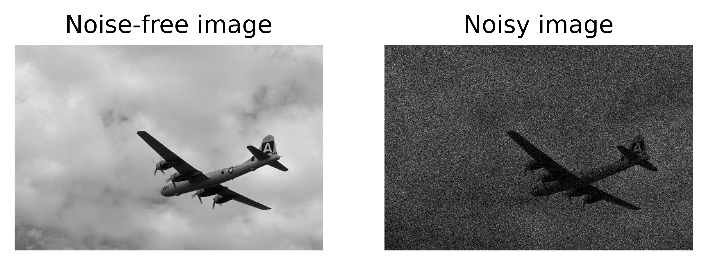

# PoGaIN: Poisson-Gaussian Image Noise Modeling from Paired Samples

Authors: Nicolas Bähler, Majed El Helou, Étienne Objois, Kaan Okumuş, and Sabine
Süsstrunk, _Fellow_, _IEEE_.

<!-- TODO: add arxiv, once arxiv report, once SPL -> SPL -->
<!-- ## [[Paper](https://www.google.ch/)] - [[ArXiv](https://www.google.ch/)] - [[Complete report on ArXiv](https://www.google.ch/)] -->

## [[ArXiv](https://www.google.ch/)] - [[Abridged Supplementary Material](https://github.com/IVRL/PoGaIN/blob/main/supplementary_material/abridged_supp_mat.pdf)] - [[Complete Supplementary Material](https://github.com/IVRL/PoGaIN/blob/main/supplementary_material/supp_mat.pdf)]

## Abstract

Image noise can often be accurately fitted to a Poisson-Gaussian
distribution. However, estimating the distribution parameters from only a
noisy image is a challenging task. Here, we study the case when paired noisy
and noise-free samples are available. No method is currently available to
exploit the noise-free information, which holds the promise of achieving
more accurate estimates. To fill this gap, we derive a novel,
cumulant-based, approach for Poisson-Gaussian noise modeling from paired
image samples. We show its improved performance over different baselines
with special emphasis on MSE, effect of outliers, image dependence and bias,
and additionally derive the log-likelihood function for further insight and
discuss real-world applicability.

## Requirements

For this code base we used Python 3.9. More detailed package requirements can be
found in the [`environment.yml`](https://github.com/IVRL/PoGaIN/blob/main/environment.yml) file which can directly be used to build an
anaconda environment.

## Introduction

For this paper, we use a Poisson-Gaussian noise model introduced by Foi _et
al._ \[1\] to model noise that arises in an imaging process. Let us denote the
observed noisy image as $y$ and the ground-truth noise-free image as $x$. Then,
the Poisson-Gaussian model takes the form of the following equation:

$$
\begin{equation}
    y = \frac{1}{a} \alpha + \beta, \quad \alpha \sim \mathcal{P}(ax), \quad \beta \sim \mathcal{N}(0,b^2).
\end{equation}
$$

For example, one might have an instance like:



where $a = 11$ and $b = 0.01$.

Our method then estimates those parameters based on the noisy and noise-free
image pair and using the cumulant expansion. As a baseline we implement another estimator based on variance
(called _VAR_) which also uses image pairs. For the above example, the estimated parameters are:

```shell
===============
Ground truth:
a=11
b=0.01
===============
Log-likelihood:
LL=153825.966
===============
VAR:
a=11.08914
b=0.02098
===============
OURS:
a=10.97338
b=0.00735
===============
```

<!-- TODO add arxiv citation and finally SPL -->
<!-- ## Citation

```bibtex
@article{bahler2022pogain,
    title={{PoGaIN}: {Poisson-Gaussian} Image Noise Modeling from Paired Samples},
    author={Bähler, Nicolas and El Helou, Majed and Objois, Étienne and Okumuş, Kaan and Süsstrunk, Sabine},
    journal={IEEE Signal Processing Letters},
    year={2022},
    publisher={IEEE}
}
``` -->

## References

\[1\] [https://webpages.tuni.fi/foi/papers/Foi-PoissonianGaussianClippedRaw-2007-IEEE_TIP.pdf](https://webpages.tuni.fi/foi/papers/Foi-PoissonianGaussianClippedRaw-2007-IEEE_TIP.pdf)
